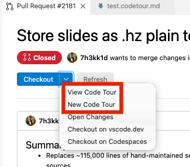
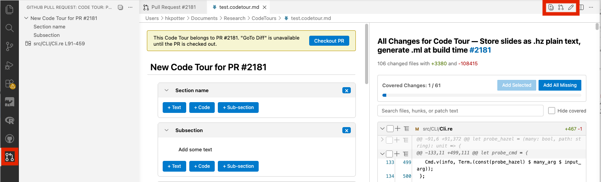

> Build Code Tours of Pull Request Changes in VS Code

This extension allows you to create and review code tours of GitHub pull requests in Visual Studio Code.

# How to use
Open a pull request overview and choose to open an existing code tour file or create a new one for the pull request.

When a code tour is opened, an overview can be seen by clicking the GitHub Pull Request icon in the activity bar.

Actions to see all of the changes and open the pull request overview for a tour's associated pull request, as well as toggling edit and view modes for a tour are found in the editor tool bar.

# Running extension locally
[How to Build and Run](https://github.com/Microsoft/vscode-pull-request-github/wiki/Contributing#build-and-run)
> [!NOTE]
> I have been able to run this with regular VS Code (not the Insiders version)

# GitHub Pull Requests VS Code Extension

This extension is built from a fork of the [GitHub Pull Requests VS Code Extension](https://github.com/Microsoft/vscode-pull-request-github). See [its documentation](https://marketplace.visualstudio.com/items?itemName=GitHub.vscode-pull-request-github) for the GitHub features.
