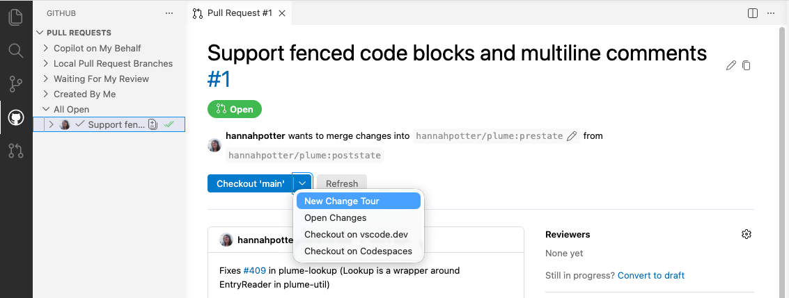

> Change Tours: Pull Request Code Reviews via Structured Narratives in VS Code

This extension allows you to create and review Change Tours of GitHub pull requests in Visual Studio Code. Change Tours are structured, ordered narratives coupled to a change list to guide a developer performing a pull request code review through the change. The change list is interleaved with the narrative to contextualize, group, filter, and order the diffs with respect to the narrative.

# How to use

## Installing the extension

> [!IMPORTANT]
> This extension is a fork of [Microsoft's GitHub Pull Requests](https://marketplace.visualstudio.com/items?itemName=GitHub.vscode-pull-request-github). It ships under a distinct extension id (`hannahpotter.changetours-vscode-pull-request-github`), so VS Code allows both extensions to be installed at the same time - but the fork still registers many of the same commands, views, and settings as the upstream, so running both at once typically produces duplicated commands or unpredictable UI. **Uninstall or disable the upstream GitHub Pull Requests extension before installing this `.vsix`.**

There are two ways to get the extension: download a prebuilt `.vsix` from the GitHub Releases page, or build one from source.

### Option 1: Install from a GitHub Release

Best for most users - no Node toolchain required.

1. Go to the [Releases page](https://github.com/hannahpotter/changetours-vscode-pull-request-github/releases) and download the latest `changetours-vscode-pull-request-github-<version>.vsix` asset.
2. Install the `.vsix` in VS Code, either from the command line:
	```sh
	code --install-extension changetours-vscode-pull-request-github-<version>.vsix
	```
	or from the VS Code UI: open the Extensions view, click the `...` menu in the top-right, choose **Install from VSIX...**, and select the file.
3. Reload VS Code if prompted.

### Option 2: Build from source

Use this path if you want to run unreleased changes, work on the extension itself, or build for a target the release pipeline doesn't publish.

**Prerequisites:** [Node.js 20.x](https://nodejs.org/) (matches the release pipeline; newer versions may surface transitive type drift).

1. Clone this repository and install dependencies:
	```sh
	git clone https://github.com/hannahpotter/changetours-vscode-pull-request-github.git
	cd changetours-vscode-pull-request-github
	npm ci
	```
2. Build a `.vsix` package:
	```sh
	npm run package
	```
	This produces `changetours-vscode-pull-request-github-<version>.vsix` in the repository root. The `package` script invokes `vsce package`, which first runs `vscode:prepublish` (clean + bundle) so the VSIX always contains a fresh build.
3. Install the `.vsix` in VS Code, either from the command line:
	```sh
	code --install-extension changetours-vscode-pull-request-github-<version>.vsix
	```
	or from the VS Code UI: open the Extensions view, click the `...` menu in the top-right, choose **Install from VSIX...**, and select the file.
4. Reload VS Code if prompted.

See the VS Code Pull Request Extension wiki for [how to build and run for development/debugging](https://github.com/Microsoft/vscode-pull-request-github/wiki/Contributing#build-and-run).

### Optional: enabling VS Code "proposed" APIs

This extension inherits its base from upstream's GitHub Pull Requests extension, which opts into a handful of VS Code's experimental "proposed" APIs (richer comment integrations, the multi-diff editor, etc.). On startup you'll see an extension-host log line that reads:

> *Extension 'hannahpotter.changetours-vscode-pull-request-github' CANNOT USE these API proposals 'activeComment, …'. You MUST start in extension development mode or use the --enable-proposed-api command line flag*

**You can safely ignore this message for normal Change Tour work** - the authoring/review UI, the AI assistant, the Anthropic key storage, and the Claude Code skill all use stable APIs and work without the flag. The denial only affects a few inherited upstream features (e.g. some comment-composer affordances, the multi-diff "all changes" tab, share menu items).

If you want those features back, launch VS Code with the flag:

```sh
code --enable-proposed-api hannahpotter.changetours-vscode-pull-request-github
```

Or make it persistent: Command Palette → **"Preferences: Configure Runtime Arguments"** and add the extension id to the `enable-proposed-api` array in `argv.json`. After saving, fully quit and reopen VS Code.

## Opening/Creating a Change Tour



Open a pull request overview and choose to open an existing Change Tour file or create a new one for the pull request. Tours are created/opened at `<repoRoot>/.changetours/<prNumber>-<sanitized-title>.changetour.md`. See the [schema documentation](/documentation/CHANGETOURSCHEMA.md) for details on how Change Tours are stored.


Use the `Toggle Edit/Review Mode` button in the Editor Actions toolbar to switch between edit mode and review mode.

## Editing a Change Tour (Edit Mode)


The Change Tour editor offers 2 primary ways to edit:
- Manual editing
- AI assistant editing (both interactive and fully automated modes)
	- ✨ buttons in the editor
	- Copilot Chat participant `@change-tour`
	- Claude Code CLI

The ✨ buttons and Copilot Chat participant use whichever LLM provider is configured and can be set to use an Anthropic API key - see instructions on [how to set the LLM provider](documentation/AUTHORING.md#llm-provider).

For a more detailed overview of the editing features, including information about the AI assistants and how to customize the AI prompts, see the [authoring documentation](documentation/AUTHORING.md).

## Reviewing the Pull Request with a Change Tour (Review Mode)


The core interactions for reviewing are:
- Section selection: Clicking a section in the tour **filters** the change list to only show the changes that are included in that section of the tour.
- Paragraph selection: Clicking a paragraph in the tour applies any **highlights** to specific lines of code in the change list.

Directly add comments on the tour and change list to be added to the GitHub pull request.

For a more detailed overview of the reviewing features, see the [reviewing documentation](documentation/REVIEWING.md).

# Reporting bugs

Found a bug or have a feature request? Please [open an issue](https://github.com/hannahpotter/changetours-vscode-pull-request-github/issues) on the GitHub repository. When filing a bug, it helps to include:

- The extension version (Extensions view → Change Tours for GitHub Pull Requests → Version), VS Code version, and your OS.
- Steps to reproduce, what you expected, and what actually happened.
- Any relevant output from the **Output** panel (select **Change Tours** from the dropdown).
- A screenshot or short screen recording if the issue is visual.

For issues with the underlying GitHub Pull Requests functionality (not specific to Change Tours), you may also want to check the [upstream extension's issues](https://github.com/Microsoft/vscode-pull-request-github/issues).

# GitHub Pull Requests VS Code Extension

This extension is built from a fork of the [GitHub Pull Requests VS Code Extension](https://github.com/Microsoft/vscode-pull-request-github). See [its documentation](https://marketplace.visualstudio.com/items?itemName=GitHub.vscode-pull-request-github) for the GitHub features.

# AI Disclosure & Acknowledgements

This project is an AI-accelerated research prototype. A substantial portion of the codebase, including core logic, architectural structure, and script generation, was written by Generative AI under human direction.

* **Primary AI Tools:** Anthropic's [Claude](https://anthropic.com) and GitHub [Copilot](https://github.com).
* **Role of AI:** Acted as the primary developer to rapidly translate research concepts into functional code and build the prototype.
* **Human Role:** Conceptualized the vision, directed the system requirements via prompting, and manually spot-checked the functional interface to ensure it met project goals.

## Prototype Limitations & Disclaimer

Because this codebase was rapidly generated by AI to serve as a research prototype, users should keep the following limitations in mind:

* **Limited Code Review:** The functional interfaces were manually spot-checked for high-level functionality but the underlying source code has not undergone a rigorous, line-by-line engineering audit.
* **Edge Cases & Stability:** The application is optimized for standard use cases; inputting unexpected data or edge-case actions may cause unhandled exceptions or crashes.
* **Security & Performance:** The code was not audited for production-grade security vulnerabilities or optimal memory/CPU performance.
* **Intended Use:** This software is provided "as-is" strictly as a proof-of-concept for research purposes and is not intended for production deployment.

