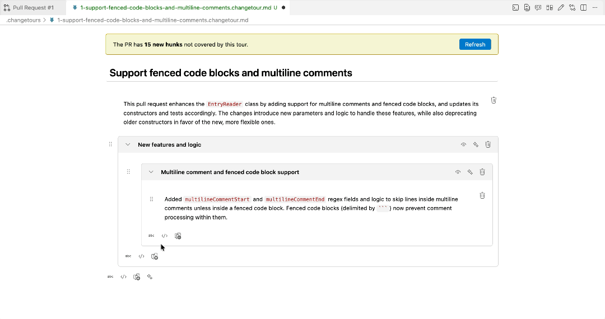
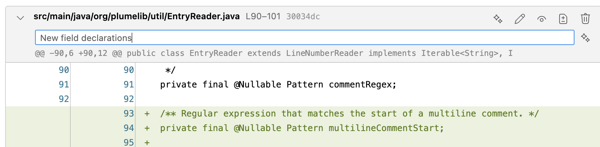
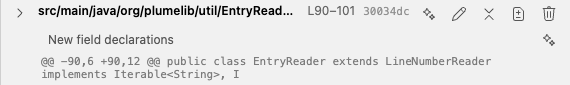
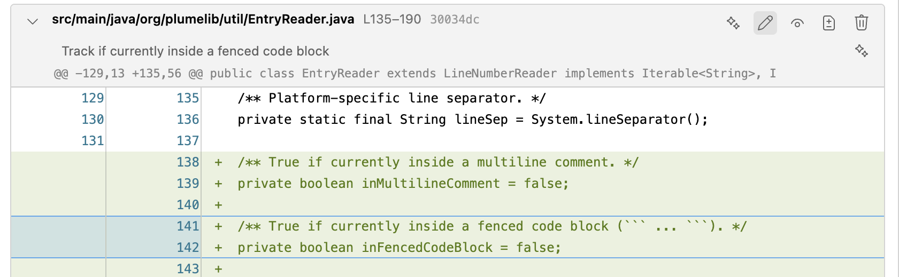
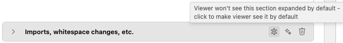
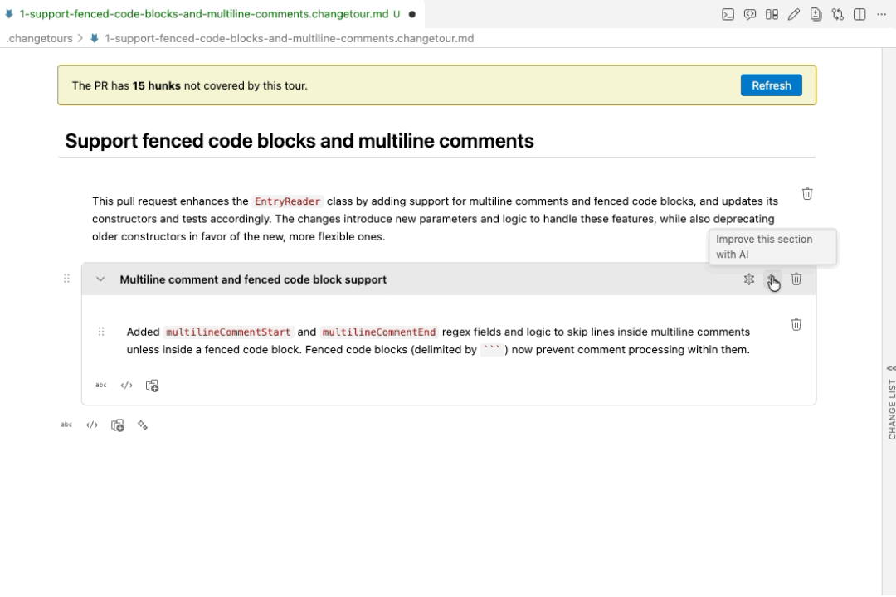
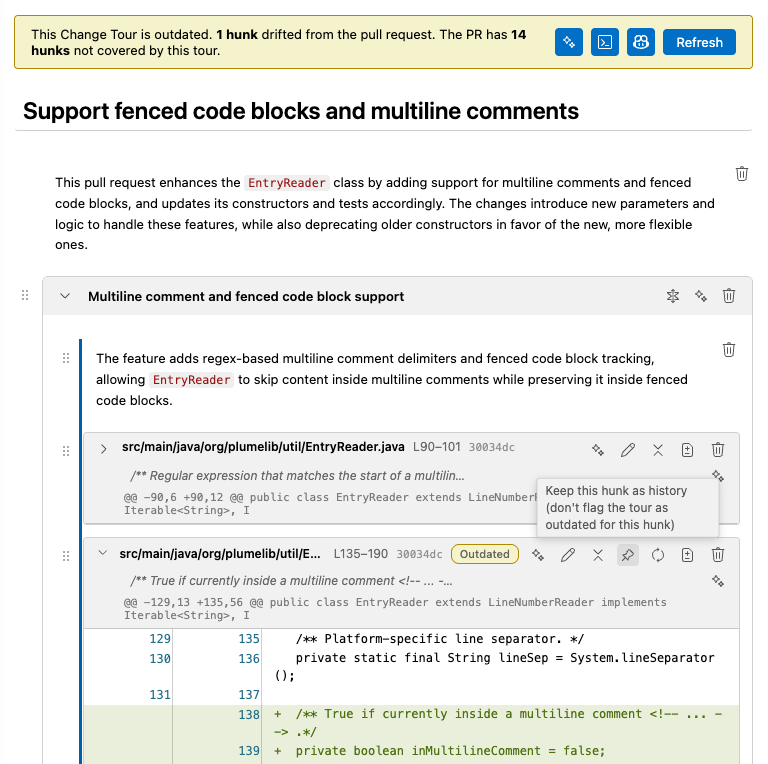

# Editing Change Tours
- [Editor Actions](#editor-actions)
- [Manual Editing](#manual-editing)
- [AI Assistant](#ai-assistant)
	- [Entry Points](#entry-points)
	- [Customizing the Assistant's Instructions](#customizing-the-assistants-instructions)
	- [Using the Claude Code CLI](#using-the-claude-code-cli)
	- [LLM Provider](#llm-provider)
	- [Tour Validation](#tour-validation)
- [Drift Detection](#drift-detection)

## Editor Actions

While *editing* Change Tours, the Editor Actions toolbar contains the following actions:
- **Edit Change Tour with Claude Code (Terminal)**: Opens the terminal with a prefilled Claude invocation (see [Using the Claude Code CLI below](#using-the-claude-code-cli) for details)
- **Open Change Tour Hunk Selector**: Open the pull request diff to select hunks to add to the Change Tour
- **Open Pull Request Overview**: Open the GitHub Pull Request overview
- **Toggle Diff Layout (Inline / Side-by-Side)**: Switch the diff layout between inline (unified) and side-by-side
- **Toggle Edit / Review Mode**: Switch the Change Tour view between edit and review modes

## Manual Editing


Use the buttons to add text, hunks, and sections to the Change Tour. Use drag-and-drop to rearrange elements.
- **Text**: Text nodes are rendered as Markdown.
- **Hunks (Diffs)**: Choosing to add a hunk opens the Hunk Selector Panel showing the diff of the pull request.
	- Drag-and-drop or use the buttons in the Hunk Selector Panel to add hunks to the tour.
	- The panel indicates how much of the change list has been included/covered in the tour.
	- Edit the hunk summary to include additional narrative. These summaries will be visible even when the hunk is collapsed.
	- Add highlighting to a hunk to call additional attention to particular lines of the change.
	- To see the file context for any hunk in the tour, click the `Open in file context` button.
	- To exclude a hunk/file from the tour's coverage report, click the eye-closed icon next to a hunk/file header in the Hunk Selector Panel. For an entire directory or a glob of files, run the command palette entry **GitHub Pull Requests: Exclude Files from Change Tour by Pattern** and supply a pattern like `src/generated/**` or `**/*.d.ts`. You'll be prompted for an optional exclusion reason. Excluded entries are written to an appendix at the tail of the tour file; the drift/coverage tools then skip them.
- **Sections**: Click the section title to edit.

Sections and hunks can be set to be collapsed in view mode by default.

## AI Assistant


The extension includes an LLM assistant that can build Change Tours for you. It works in two modes:

- **Fully automated** - point the assistant at a pull request and it produces a complete tour (hunks selected, grouped into sections, narration written), streaming into the open editor as it works.
- **Interactive** - collaborate with the assistant turn-by-turn via chat, or use per-hunk / per-section inline buttons in the editor.

### Entry Points

**Editor toolbar (✨ buttons)** - open a `.changetour.md` file in edit mode:
- The sparkle on the top-level toolbar (located at the bottom of the tour) auto-generates a full tour for the bound pull request.
- The sparkle on each hunk drafts narration for just that hunk and inserts it immediately after.
- The sparkle on each hunk summary line drafts a hunk summary.
- The sparkle on each section makes edits (including highlights, added diffs, improved narration) to that section only.

A streaming indicator appears at the top of the editor while the assistant is working, with a stop button to cancel.

**Chat participant `@change-tour`** - type in the Copilot Chat panel:
- `@change-tour /generate` - build a full tour for the active PR
- `@change-tour /suggest` - propose the next hunk or section to add
- `@change-tour /narrate` - draft narration for a referenced hunk
- `@change-tour /improve` - polish the current tour
- `@change-tour /update` - update the tour when the related pull request has been updated
- `@change-tour <free-form question>` - ask anything; the assistant may call read-only tools to ground its answer

For `/generate` and `/improve` the assistant automatically reads the PR title and body and uses them as the author's framing for the tour.

### Customizing the Assistant's Instructions

The default system prompts ship with the extension under `resources/changeTour/defaultInstructions/`. To layer your own house rules on top, drop a `custom-instructions.md` file into the repo's `.changetours/` folder:

```
.changetours/custom-instructions.md
```

Its contents are appended to every mode's default prompt (after a separator). Use it for things like "open every tour in second person" or "skip whitespace-only hunks entirely" - you only need to write the parts you want to add; the defaults stay maintained by the extension.

### Using the Claude Code CLI

For users who prefer driving an external agent, the extension ships a project-scoped Claude Code skill that handles both editing existing tours and bootstrapping new ones from a PR.

**Dependencies**

- **Claude Code** - install via `npm install -g @anthropic-ai/claude-code`, then sign in with `claude login` (or set the `ANTHROPIC_API_KEY` environment variable). See https://docs.claude.com/claude-code for canonical install/auth docs.
- **GitHub CLI (`gh`)** - install via `brew install gh` (macOS), `winget install --id GitHub.cli` (Windows), or see https://cli.github.com/. Authenticate with `gh auth login`. Required so the skill can read PR metadata and the validator can cross-check hunks against the live PR diff.

**Skill install**

On first use of the command palette action **"Change Tour: Edit Change Tour with Claude Code (Terminal)"**, the extension writes `<repoRoot>/.claude/skills/change-tour/SKILL.md`. The skill is project-scoped, so it gets committed to the repo and travels with the project - collaborators with `claude` installed pick it up automatically. If the file already exists (you customized it), the extension leaves it alone.

**Three ways to use it**

*1. From the VS Code command palette or the Editor Actions toolbar* - runs the action above and drops you into a terminal with `claude "Use the change-tour skill to edit @<path>"` (or a bootstrap variant if no tour file is active). The command is queued but **not yet sent** - review/edit it and hit Enter to launch. After Claude finishes the one-shot, the terminal returns to your shell.

*2. From any shell as a one-shot* - once the skill is checked into the repo, run:

```
claude "Use the change-tour skill on @path/to/file.changetour.md"
```

to edit an existing tour, or

```
claude "Use the change-tour skill to bootstrap a Change Tour for PR <num>"
```

to create one from scratch. Claude executes the request, prints its output, and exits. Good for scripting, CI, or one-and-done edits.

*3. From any shell, interactively* - when you want to iterate (ask follow-ups, course-correct mid-edit, run several `/improve`-style passes), drop into Claude Code's REPL:

```
cd <repoRoot>
claude
```

`claude` with no prompt argument opens an interactive session in your terminal. From the prompt you can:

- **Invoke the skill by name or intent**: type `Use the change-tour skill to edit @path/to/file.changetour.md` (or `... to bootstrap a Change Tour for PR 1234`). Claude Code auto-loads project-scoped skills from `.claude/skills/`, so the change-tour skill is available as soon as you're in the repo.
- **Attach files with `@`**: `@path/to/file` adds that file to the conversation context. Tab-completes paths.
- **Iterate**: after Claude finishes a pass, just keep typing: "tighten the narration in the Data model section", "regroup hunks 3-5 under a new heading", "add a Miscellaneous section for the trivial test changes", etc. Claude keeps the conversation history within the session.
- **Resume later**: exit with Ctrl+D. Use `claude --continue` from the same directory to resume the most recent session, or `claude --resume` to pick from a list.

Useful in-session slash commands (typed at the prompt):

- `/help`: show all built-in commands.
- `/clear`: start a fresh conversation (preserves the loaded skills).
- `/cost`: show the running token spend for the session.

The skill itself works the same in all three modes - same preflight, same validation, same format contract. Interactive mode is just easier when you want to negotiate with Claude rather than fire-and-forget.

**Validator**

The skill instructs Claude Code to run `node .claude/skills/change-tour/validate-change-tour.js <relPath>` after each significant edit. The validator ships in the skill folder so it works in any repo where the skill is installed - you don't need the extension's source tree. It catches structural problems (missing frontmatter, malformed hunk directives, missing patch bodies, bad highlight syntax) and, if `gh` is authenticated, also:

- **Rejects hunks not in the PR**: every hunk in the tour must match a real PR hunk.
- **Warns about PR hunks not covered by the tour**: every PR hunk should appear in the tour. Uncovered ones are reported as warnings by default; pass `--require-full-coverage` to make them errors (the skill body runs the strict variant as a final check after a `/generate`).

Pass `--skip-pr-check` to skip the live cross-check entirely (e.g. for offline work - but you lose both the validity and coverage checks).

### LLM Provider

By default the assistant uses VS Code's language model API, so it works with whatever chat model you have installed (Copilot's GPT-4o, Copilot's Claude 3.5 Sonnet, Cody, Continue, etc.) and respects the model you've picked in the Copilot Chat dropdown.

If you don't have Copilot but do have an [Anthropic API key](https://console.anthropic.com/settings/keys), run "Change Tour: Set Anthropic API Key" once. The assistant will fall back to calling the Anthropic API directly. The key is stored in VS Code SecretStorage.

Relevant settings (search "Change Tour" in settings UI):
- `changeTour.assistant.enabled` - master switch (default `true`)
- `changeTour.assistant.provider` - `auto` (default), `vscode-lm`, or `anthropic`
- `changeTour.assistant.anthropicModel` - model name for the Anthropic fallback (default `claude-sonnet-4-5`)
- `changeTour.assistant.maxAgentTurns` - safety cap on the agent loop (default 25)

### Tour Validation

The assistant only generates valid tours: every hunk it inserts is resolved server-side against the bound pull request's diff, so refs and patch content are always correct. The toolbar button is disabled until the document has pull request frontmatter (created automatically by "Pull Request: New Change Tour").

## Drift Detection
If the Change Tour is out of date with the underlying pull request, a banner is shown with options to have the AI assistant update the tour. Individual hunks that are out of date show an indicator badge. Hunks from previous commits can be pinned to the tour as history.

