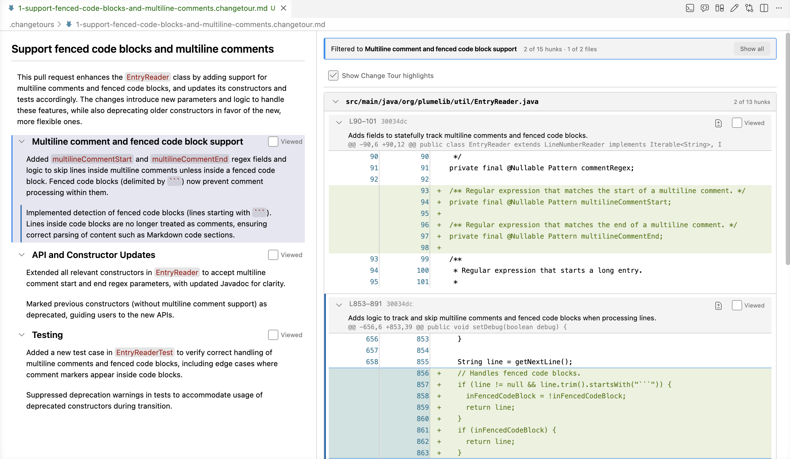

# Reviewing Change Tours

Use Change Tours to guide a code review.
- The Change Tour narrative appears in the left panel.
	- Selecting on a section filters to all hunks associated with that section.
	- Selecting a paragraph within a section applies highlighting to the hunks associated with that paragraph.
	- Selecting the **Excluded (N)** entry (if applicable) at the bottom of the outline filters the change list to show only the hunks the author explicitly excluded from the tour.
- Use the `Open in file context` button on a hunk to see the surrounding file content.
- Add GitHub comments directly to the hunks or directly to text in the tour.
- Mark individual hunks as viewed or mark all hunks for a section as viewed to track progress.